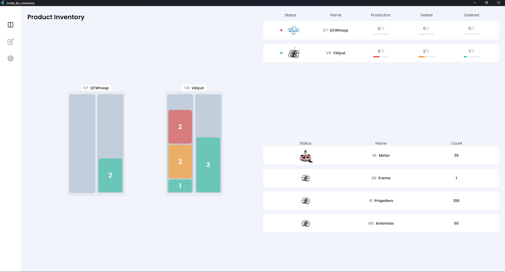

# Inventory Management System

This project uses 2 parts -

- Frontend App to view the number of drones and components available
  in their warehouse and which drone is in which stage (Production,
  Testing and Ready for Delivery). These details are updated in
  real-time using Socket IO (Web Sockets). This app is made using
  Flutter.

- Backend Server to manage these real-time changes from the hardware
  and update the data in the frontend app. This server is mage using
  TypeScript, Express JS and Socket IO. We have used Mongo DB as
  database. [GitHub
  Repository](https://github.com/bhaswanth-isani8055/inside-fpv-server)

The data for each component is reduced when a drone enters production
stage based on the relations made between drones and components. For
example, if a drone requires 4 motors and it enters production stage
then 4 motors are automatically reduced.
